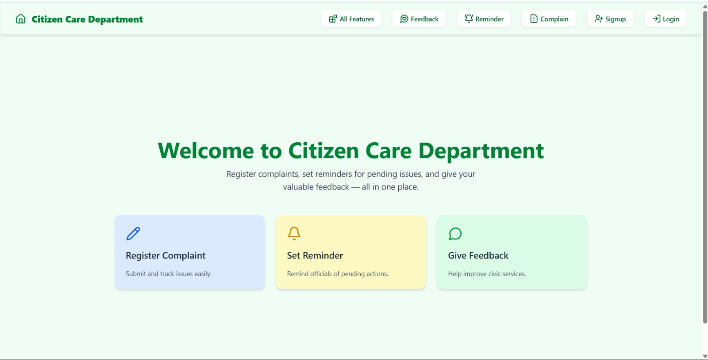
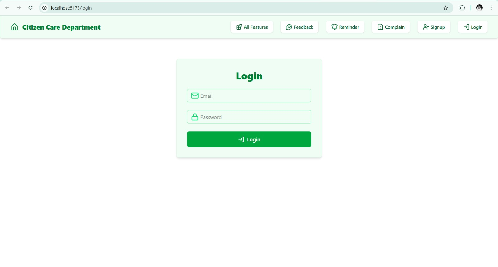
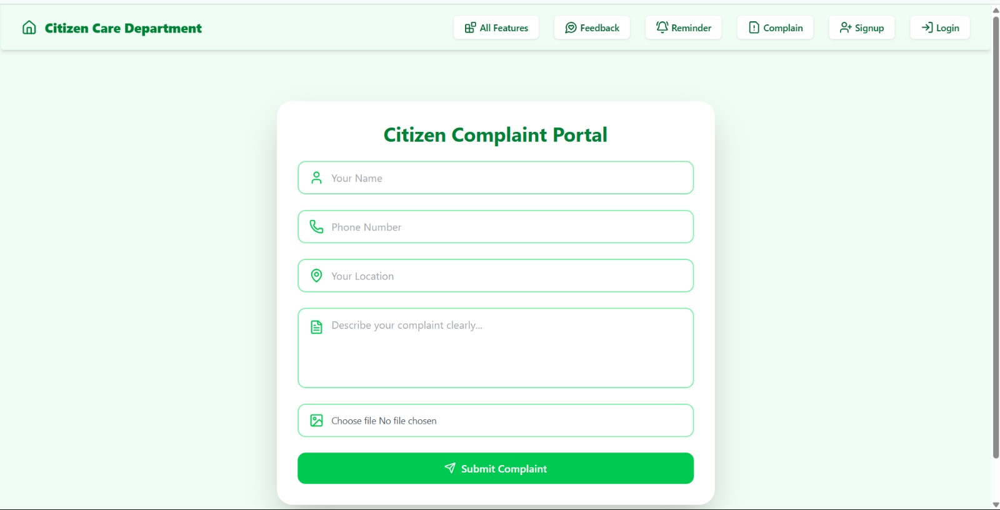
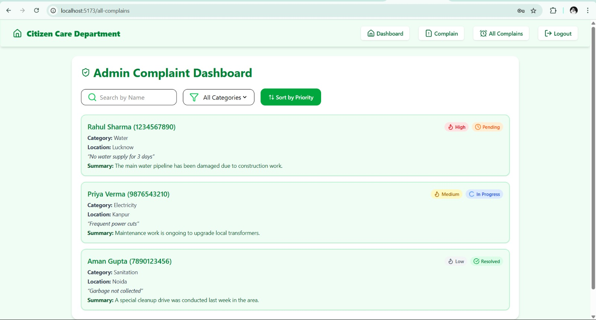
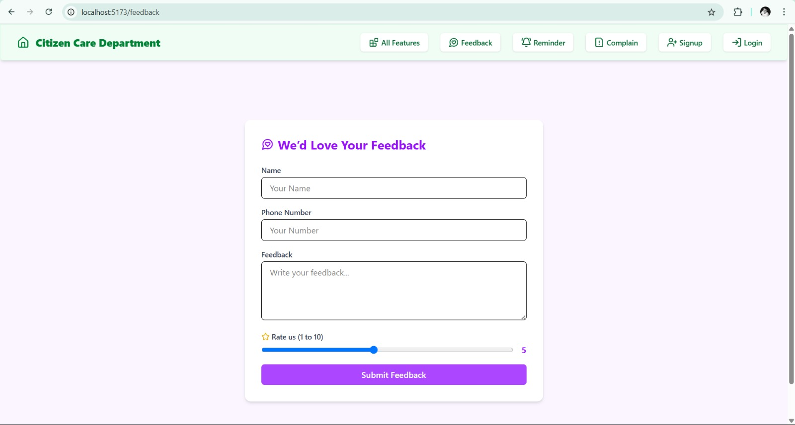
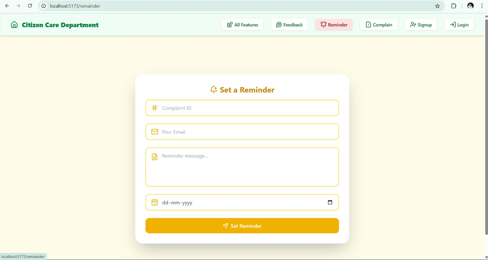
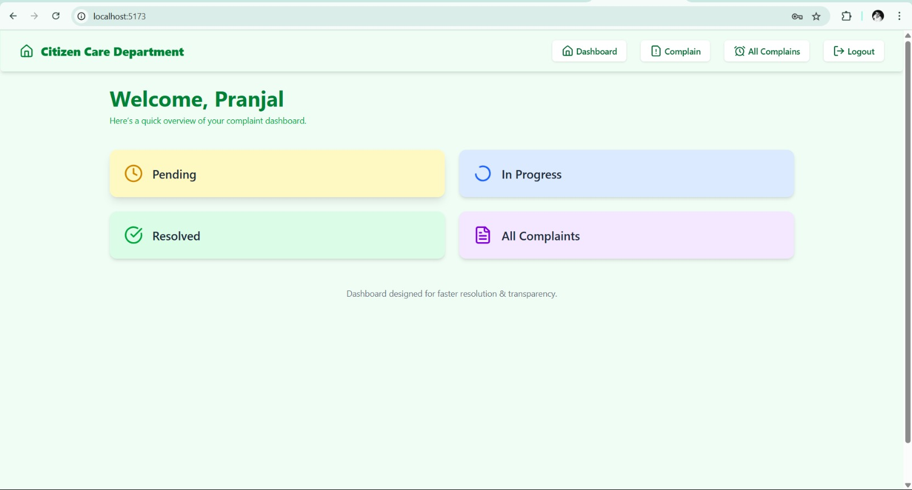

# RAG based - Customer Grievance Redressal System

This project implements *AI-Powered Citizen Complaints Categorization* that classifies citizen complaints into categories based on *priority, **sentiment, and **department* using a *Retrieval Augmented Generation (RAG)* architecture.

---

## Features

1. *Complaint Classification*  
   Automatically classifies citizen complaints into predefined categories based on various criteria.

2. *Retrieval Augmented Generation (RAG)*  
   Enhances classification accuracy by retrieving and incorporating relevant historical complaint data.

3. *Gemini Integration*  
   Utilizes Google's state-of-the-art *Gemini-2.0-flash* model for robust natural language understanding and generation.

4. *FastAPI Backend*  
   Provides a high-performance, asynchronous API for seamless integration with front-end applications or other services.

5. *Vector Embeddings*  
   Uses embeddings to find semantically similar complaints for context enhancement during classification.

6. *Admin Dashboard*
   Contains total complaints overview, category-wise breakdown, recent feedback & complaint activity, complaint status updates.

---

## Technologies Used

### Frontend
- *MERN Stack* (MongoDB, Express, React, Node.js)
- *React*
- *Vite* – for fast front-end tooling and development server
- *Tailwind CSS* – utility-first CSS framework
- *Lucide React* – for customizable icons

### Backend
- *Python*
- *FastAPI* – for building the REST API
- *Google Generative AI* – for integrating with Gemini Pro
- *Pandas* – for data manipulation
- *Sentence-Transformers* – for generating embeddings
- *Conceptual Vector Store* – for storing and retrieving embeddings

---

## Setup and Installation

### 1. Clone the Repository
bash
git clone <your-repository-url>
cd <your-project-directory>

### 2. Create and Activate a Virtual Environment
bash
python -m venv venv

### 3. Install Dependencies
bash
pip install -r requirements.txt

### For Backend : 
cd backend 
npm i 
npm run dev

### For Frontend : 
cd frontend
npm i
nmp run dev

### Sample Screenshots

